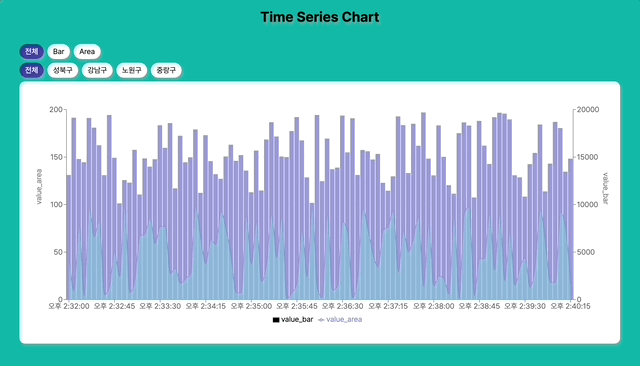

# 📊 Time Series Chart

원티드 프리온보딩 인턴십 4주차 개인 과제 레포지토리입니다.

## 🎯 프로젝트 소개

- 주제 : 주어진 데이터를 기반으로 시계열 차트 만들기
- 작업 기간 : 2023.09.10 ~2023.09.13

## 📝 과제 요구사항

1. 시계열 차트 만들기
   - 하나의 차트안에 Area 형태의 그래프와 Bar 형태의 그래프가 모두 존재하는 복합 그래프 구현
2. 호버 기능 구현
   - 특정 데이터 구역에 마우스 호버시 `id, value_area, value_bar` 데이터를 툴팁 형태로 제공
3. 필터링 기능 구현
   - 필터링 기능을 구현. 필터링은 특정 데이터 구역을 하이라이트 하는 방식으로 구현
   - 필터링 기능은 버튼 형태로 ID값(지역이름)을 이용
   - 필터링 시 버튼에서 선택한 ID값과 동일한 ID값을 가진 데이터 구역만 하이라이트 처리
   - 특정 데이터 구역을 클릭 시에도 필터링 기능과 동일한 형태로 동일한 ID값을 가진 데이터 구역을 하이라이트

## 🛠 사용한 기술 스택 및 라이브러리

- `Vite`
- `React`
- `Typescript`
- `React-Router-Dom`
- `Tailwind CSS`
- `Axios`
- `Recharts`

## 🎬 프로젝트 로컬 실행 방법

1. 본 repository를 clone합니다.

```bash
git clone https://github.com/chaehaeun/Time-Series-Chart.git
```

2. 의존성 패키지를 설치합니다.

```bash
npm install
```

3. 로컬호스트를 실행합니다.

```bash
npm run dev
```

## 🚀 배포 링크

[👉 배포 링크로 이동](https://time-series-chart-amber.vercel.app/)

## 🗂️ 폴더 구조

```zsh
.
├── README.md
├── index.html
├── package-lock.json
├── package.json
├── postcss.config.js
├── public
│   ├── mock
│   │   └── db.json
│   └── vite.svg
├── src
│   ├── App.tsx
│   ├── api
│   │   └── index.ts
│   ├── components
│   │   ├── common
│   │   │   ├── Button.tsx
│   │   │   ├── Header.tsx
│   │   │   └── index.ts
│   │   ├── domain
│   │   │   ├── Chart.tsx
│   │   │   ├── CustomTooltip.tsx
│   │   │   └── index.ts
│   │   └── index.ts
│   ├── constant
│   │   └── index.ts
│   ├── context
│   │   ├── ChartDataContext.tsx
│   │   └── index.ts
│   ├── db
│   ├── index.css
│   ├── main.tsx
│   ├── pages
│   │   ├── NotFound.tsx
│   │   └── index.ts
│   ├── router
│   │   └── index.tsx
│   ├── types
│   │   └── index.ts
│   └── vite-env.d.ts
├── tailwind.config.js
├── tsconfig.json
├── tsconfig.node.json
└── vite.config.ts

```

## ✏️ 구현 내용

| 시계열 차트               |
| ------------------------- |
|  |

#### 시계열 차트 만들기

- 하나의 차트안에 Area 형태의 그래프와 Bar 형태의 그래프가 모두 존재하는 복합 그래프 구현
  - `Recharts` 라이브러리의 `ComposedChart`를 사용하여 Area, Bar 형태의 그래프를 구현

#### 호버 기능 구현

- 특정 데이터 구역에 마우스 호버시 `id, value_area, value_bar` 데이터를 툴팁 형태로 제공
  - 기본 제공되는 `Tooltip` 컴포넌트를 커스텀하여 구현

#### 필터링 기능 구현

- 필터링 기능을 구현. 필터링은 특정 데이터 구역을 하이라이트 하는 방식으로 구현

```tsx
const LocationList = Array.from(new Set(chartData.map((item) => item.id)));
```

- 필터링 기능은 버튼 형태로 ID값(지역이름)을 이용
  - 고정값을 사용하지 않고 동적으로 버튼을 생성하기 위해 `chartData`의 `id`값을 중복을 제거하여 `LocationList`를 생성
- 필터링 시 버튼에서 선택한 ID값과 동일한 ID값을 가진 데이터 구역만 하이라이트 처리
- 특정 데이터 구역을 클릭 시에도 필터링 기능과 동일한 형태로 동일한 ID값을 가진 데이터 구역을 하이라이트

```

```
